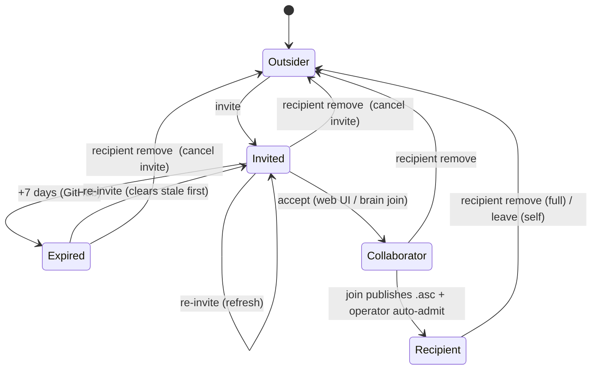

# Target: collaborator / recipient membership state machine

A person's membership in a shared brain is **not one bit** — it's a lifecycle
that spans **two independent layers**, each with its own store and its own key:

- **GitHub layer (transport / ACL)** — can they *reach* the encrypted bytes?
  Keyed by **GitHub login**. Stores: a pending repo *invitation*, or an accepted
  *collaborator* grant.
- **Crypto layer (decryption)** — can they *read* the bytes? Keyed by **GPG
  fingerprint**. Stores: the manifest `recipients:` list, the `keys` branch
  pubkey(s), and `verified.yaml`.

The two layers move at different times, so a person legitimately passes through
states where one layer holds and the other doesn't (invited-but-not-accepted;
collaborator-but-not-yet-admitted). The commitment this target defends: **every
operation reasons about the full state machine and both layers, and every
removal clears every store — so a person can be moved cleanly between states with
no drift and no resurrection.** The dogfood kept breaking exactly where an
operation knew about one layer/store but not the others (#38, #39, #40).

## State machine



ASCII (same thing, for terminal review):

```
 Outsider
    │  invite ──────────────────────────────────────────────┐
    ▼                                                        │
 Invited ──(+7d)──▶ Expired ──re-invite──▶ Invited          │
    │  accept (web UI / `nous brain join`)                   │
    ▼                                                        │
 Collaborator  (GitHub access; NOT yet a manifest recipient) │
    │  join publishes <login>.asc  +  operator auto-admit    │
    ▼                                                        │
 Recipient  (manifest + keys branch + collaborator)          │
    │                                                        │
    └── recipient remove / leave ───────────────────────────┘ ▶ Outsider
        (any non-Outsider state → Outsider via `recipient remove`)
```

### States × stores (the drift surface)

A "set" cell is a store that should hold in that state. A complete **removal must
clear every set cell** for the person.

| State        | GitHub invite | GitHub collaborator | manifest recipient | keys `<login>.asc` | verified.yaml | local keyring |
|--------------|:---:|:---:|:---:|:---:|:---:|:---:|
| Outsider     | – | – | – | – | – | – |
| Invited      | ✅ pending | – | – | – | – | – |
| Expired      | ⏳ expired | – | – | – | – | – |
| Collaborator | – | ✅ | – | maybe¹ | – | – |
| Recipient    | – | ✅ | ✅ | ✅ | optional² | ✅ (operator has their pubkey) |

¹ `<login>.asc` appears once `nous brain join` publishes it, before auto-admit runs.
² `verified.yaml` is written only by the explicit verify ceremony; **auto-admit does not write it**, so most admitted recipients have no entry. (This absence is what broke login resolution in #40 bug A.)

### Transitions × operation × code

| Transition | Operation | Where | Notes / issue |
|---|---|---|---|
| Outsider → Invited | `nous brain invite <login>` | `gh.InviteCollaborator` (clear stale → PUT) | re-invite re-sends (#39) |
| Invited → Expired | (none — GitHub) | 7-day GitHub policy | not configurable |
| Expired/Invited → Invited | `nous brain invite` again | `gh.InviteCollaborator` deletes stale invite first | #39 |
| Invited → Collaborator | invitee accepts | GitHub web UI, or `nous brain join` | — |
| Collaborator → Recipient | join + auto-admit | `PublishOwnPubkeyToRemote` then `AutoAdmitFromKeysBranch` + `ImportAllPubkeys` | no verified.yaml write |
| Recipient → Outsider | `nous brain recipient remove` | `brainsync.RemovePerson` → `RemoveRecipient` | manifest+rekey+verified+keys+collab+invite (#38, #40) |
| Collaborator → Outsider | `nous brain recipient remove <login>` | `brainsync.RemovePerson` (non-recipient path) | cancel invite + revoke collaborator (#40) |
| Invited/Expired → Outsider | `nous brain recipient remove <login>` | `brainsync.RemovePerson` → `cancelPendingInvitation` | #40 |
| Recipient → Outsider (self) | `nous brain leave` | `brainsync.LeaveBrain` | self-removal |

## Invariants we defend

1. **Two layers, reasoned about independently.** Never assume recipient ⟺
   collaborator. Operations resolve both the login (GitHub) and the fingerprint
   (crypto) and act on each layer present.
2. **Removal clears EVERY store — no resurrection.** A complete removal clears:
   manifest, **all** keys-branch `.asc` for the fp (both `<FP>.asc` and
   `<login>.asc`, matched by content), verified.yaml, the GitHub collaborator,
   and any pending invitation. Leaving one store lets auto-admit or re-invite
   bring the person back (the #38/#40 bug class).
3. **Resolve identity before destructive deletes.** login↔fp resolution
   (verified.yaml → keys branch → peer sidecar) happens *before* deleting the
   sources it reads. (#40 bug A was resolving the login after `RevokePubkey`
   deleted the `<login>.asc` it needed.)
4. **One implementation per operation, shared by CLI + TUI.** CLI/TUI drift is
   the recurring failure (TUI remove once skipped the keys-branch + collaborator
   steps entirely). Each lifecycle op lives in one lib function both call.
5. **Re-invite must re-send.** GitHub's PUT-collaborator is a no-op against an
   existing (even expired) invitation, so invite deletes the stale invitation
   first. (#39)
6. **Revocation is forward-only.** Removal re-keys future pushes; blobs already
   fetched or already in the remote stay readable with the removed key. True
   revocation requires re-keying/rotation — out of scope; the threat model says
   so.
7. **Per-brain ≠ everywhere.** These operations only touch brains checked out
   locally. Removing a person from *all* brains, and preventing re-admission on a
   later clone/sync, requires a system-wide revocation + ban list that gates
   auto-admit — that's nous#37, and the invariant there is: a banned identity
   must not be re-admittable anywhere.

## Why now

The shared-brain dogfood (nous#12) is the first real exercise of the full
lifecycle with a second person, and it kept surfacing drift: a removed recipient
kept GitHub access (#40 A), a removed person got resurrected by the keys branch /
verified.yaml (#38), an expired invite couldn't be re-sent (#39), and a
pending-but-not-accepted person couldn't be removed at all (#40 B). Each was a
case of an operation knowing about some stores but not the whole machine. Writing
the machine down makes the next operation honor all of it by default.

## What this is NOT

- Not the *cross-brain* revocation / ban-list design — that's nous#37. This
  target is the per-brain lifecycle.
- Not a redesign of the crypto/transport substrate (gcrypt + GitHub + keys
  branch) — that's the broader `shared-brain-infrastructure-and-ui` target; this
  one defends the *membership* shape on top of it.
- Not an enumeration of CLI/TUI surface — the surface can change; the invariant
  (one shared implementation, all stores cleared) is what's defended.

## Open questions

- Should `verified.yaml` be written on auto-admit (so login↔fp is always
  resolvable from one store), or kept as verify-only (its current meaning)?
  Resolving this would simplify invariant #3's resolution chain.
- Is there a state worth modeling for "collaborator accepted but never published
  a pubkey" (stuck between Collaborator and Recipient), or is the current
  best-effort handling enough?
- Where does the ban list (nous#37) live relative to this machine — a guard on
  the Outsider→Invited and Collaborator→Recipient edges?

---

*Agent-drafted 2026-06-02 from the nous#38/#39/#40 dogfood findings, for operator
review. Edit freely; this is the commitment layer, deliberately slim.*
