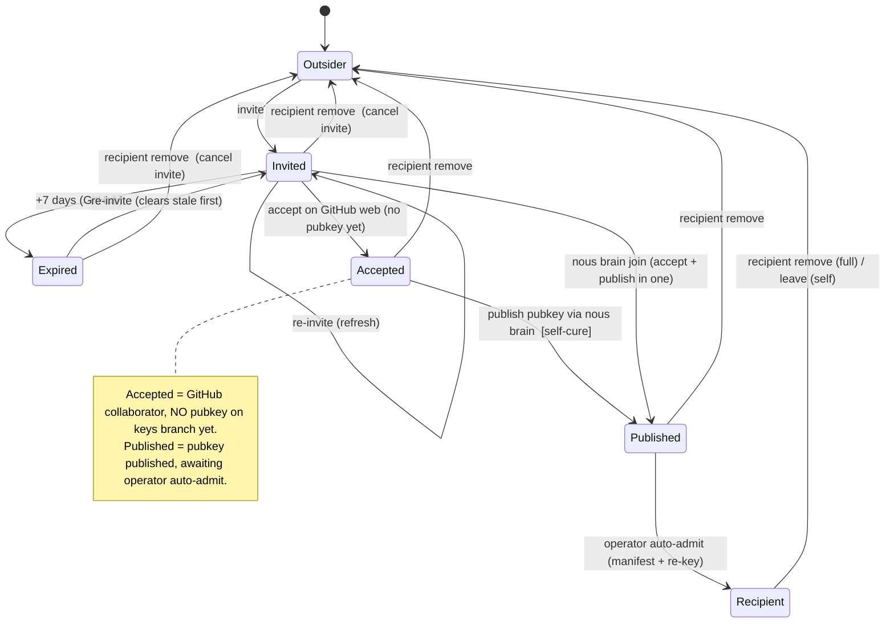

# Target: collaborator / recipient membership state machine

A person's membership in a shared brain is **not one bit** — it's a lifecycle
that spans **two independent layers**, each with its own store and its own key:

- **GitHub layer (transport / ACL)** — can they *reach* the encrypted bytes?
  Keyed by **GitHub login**. Stores: a pending repo *invitation*, or an accepted
  *collaborator* grant.
- **Crypto layer (decryption)** — can they *read* the bytes? Keyed by **GPG
  fingerprint**. Stores: the manifest `recipients:` list (+ the co-located
  `recipient_logins: {login: FP}` map — the durable admitted-fp record that lets
  auto-admit retire a superseded fp on key rotation, #41 #7/#8) and the `keys`
  branch pubkey(s). The keys-branch `<login>.asc` **is** the canonical login↔fp link —
  established the moment an invitee accepts and uploads their pubkey, the earliest
  point both halves exist. (`verified.yaml` is a *separate, optional* store — an
  offline GPG-signature-verification record for privacy-conscious operators — NOT
  the identity mapping; see invariant 3.)

The two layers move at different times, so a person legitimately passes through
states where one layer holds and the other doesn't (invited-but-not-accepted;
collaborator-but-not-yet-admitted). The commitment this target defends: **every
operation reasons about the full state machine and both layers, and every
removal clears every store — so a person can be moved cleanly between states with
no drift and no resurrection.** The dogfood kept breaking exactly where an
operation knew about one layer/store but not the others (#38, #39, #40).

## State machine



ASCII (same thing, for terminal review):

```
 Outsider
    │  invite
    ▼
 Invited ──(+7d)──▶ Expired ──re-invite──▶ Invited
    │
    ├─ accept on GitHub web (no pubkey) ─▶ Accepted (no pubkey)
    │                                          │ publish pubkey via `nous brain`  [self-cure]
    │                                          ▼
    └─ `nous brain join` (accept + publish) ─▶ Published (pubkey, awaiting admit)
                                               │ operator auto-admit (manifest + re-key)
                                               ▼
                                          Recipient (manifest + keys branch + collaborator)

 any non-Outsider state ──`recipient remove <fp|login>` / `leave`──▶ Outsider
```

### States × stores (the drift surface)

A "set" cell is a store that should hold in that state. A complete **removal must
clear every set cell** for the person.

| State                    | GitHub invite | GitHub collaborator | manifest recipient | keys `<login>.asc` | verified.yaml | local keyring |
|--------------------------|:---:|:---:|:---:|:---:|:---:|:---:|
| Outsider                 | – | – | – | – | – | – |
| Invited                  | ✅ pending | – | – | – | – | – |
| Expired                  | ⏳ expired | – | – | – | – | – |
| Accepted (no pubkey)¹    | – | ✅ | – | – | – | – |
| Pubkey published         | – | ✅ | – | ✅ | – | – |
| Recipient                | – | ✅ | ✅ | ✅ | optional² | ✅ (operator has their pubkey) |
| Recipient — local-ahead³ | – | ✅ | ✅ (local only) | ✅ | optional² | ✅ |

¹ *Accepted (no pubkey)* is the stuck state — collaborator accepted on GitHub but no pubkey on the keys branch yet (common when they accept via the GitHub web UI, outside `nous brain`). The self-cure is publishing the pubkey via `nous brain`, which moves them to *Pubkey published*. Once `<login>.asc` exists, the login↔fp link is established.
² `verified.yaml` is written only by the explicit verify ceremony (offline GPG-signature verification for privacy-conscious operators); **auto-admit does not write it**, and it is NOT the login↔fp source. #40 bug A was an *ordering* bug — `RevokePubkey` deleted the canonical `<login>.asc` before the login was resolved from it — not a missing verified.yaml entry.
³ *Recipient — local-ahead* is the transient state after a membership change (add/remove/leave) committed locally but the gcrypt re-key push failed (rejected by a concurrent push, or network) — the **local** manifest is ahead of the remote, so collaborators still see the old recipient set until the push lands. `brainsync.pushMembershipChange` (#41 #6) keeps the brain out of this state for the common race by reset-and-re-applying on a rejected push; a hard failure still lands here, and `RemoveRecipient`'s unpushed-retry path (re-`Push` when the fp is "already absent" locally) flushes it on the next invocation. Not a resurrection vector — it under-shares (remote lags), it doesn't leak. The `recipient_logins` map (`{login: FP}`) is co-located in the manifest and moves with `manifest recipient` in every row.

### Transitions × operation × code

| Transition | Operation | Where | Notes / issue |
|---|---|---|---|
| Outsider → Invited | `nous brain invite <login>` | `gh.InviteCollaborator` (clear stale → PUT) | re-invite re-sends (#39) |
| Invited → Expired | (none — GitHub) | 7-day GitHub policy | not configurable |
| Expired/Invited → Invited | `nous brain invite` again | `gh.InviteCollaborator` deletes stale invite first | #39 |
| Invited → Accepted (no pubkey) | invitee accepts on GitHub web (no pubkey) | GitHub web UI | the stuck state — needs a self-cure |
| Accepted → Pubkey published | invitee publishes pubkey via `nous brain` | `PublishOwnPubkeyToRemote` | **self-cure; entry point for accepted-elsewhere is the open question** |
| Invited → Pubkey published | `nous brain join` (accept + publish in one) | `gh.AcceptInvitation` + `PublishOwnPubkeyToRemote` | the happy path |
| Pubkey published → Recipient | operator auto-admit | `AutoAdmitFromKeysBranch` + `ImportAllPubkeys` | no verified.yaml write |
| Recipient → Outsider | `nous brain recipient remove` | `brainsync.RemovePerson` → `RemoveRecipient` | manifest+rekey+verified+keys+collab+invite (#38, #40) |
| Accepted/Published → Outsider | `nous brain recipient remove <login>` | `brainsync.RemovePerson` (non-recipient path) | cancel invite + revoke collaborator + strip any keys-branch pubkey (#40) |
| Invited/Expired → Outsider | `nous brain recipient remove <login>` | `brainsync.RemovePerson` → `cancelPendingInvitation` | #40 |
| Recipient → Outsider (self) | `nous brain leave` | `brainsync.LeaveBrain` → `stripMember` | self-removal; full strip — manifest re-key + own verified.yaml + own keys-branch `<login>.asc` + collaborator (#41 #12; shared with `RemoveRecipient`) |

## Invariants we defend

1. **Two layers, reasoned about independently.** Never assume recipient ⟺
   collaborator. Operations resolve both the login (GitHub) and the fingerprint
   (crypto) and act on each layer present.
2. **Removal clears every *brain-side* store — no resurrection.** A complete
   removal clears: manifest (incl. the `recipient_logins` entry), **all**
   keys-branch `.asc` for the fp (both `<FP>.asc` and `<login>.asc`, matched by
   content), verified.yaml, the GitHub collaborator, and any pending invitation.
   Leaving one of *these* lets auto-admit or re-invite bring the person back (the
   #38/#40 bug class). **Caveat (the `local keyring` column is the exception):**
   removal does **not** delete the removed person's pubkey from the operator's
   local GPG keyring — it's operator-managed machine state, not a brain store, and
   audit confirmed it lingers after `recipient remove`. That's not a resurrection
   vector: a pubkey in the keyring grants nothing on its own (access = being in the
   manifest + gcrypt-participants); it just means future `gpg --encrypt` *could*
   still target that key if some tool re-added it to the recipient set. An optional
   `nous brain recipient remove --purge-key` (delete the local pubkey too) is a
   possible convenience, deliberately **not** the default — the keyring is shared
   across brains, so purging a key one brain removed could break another brain that
   still lists it.
3. **Resolve identity before destructive deletes.** The canonical login↔fp link
   is the keys-branch `<login>.asc` (established at accept+publish); the peer
   sidecar (`github_user`) is a secondary source. Resolution happens *before*
   deleting the `<login>.asc` it reads. `verified.yaml` is NOT a mapping source
   (offline-sig-verification only). #40 bug A was resolving the login *after*
   `RevokePubkey` had already deleted the `<login>.asc` it needed.
4. **One implementation per operation, shared by CLI + TUI.** CLI/TUI drift is
   the recurring failure (TUI remove once skipped the keys-branch + collaborator
   steps entirely). Each lifecycle op lives in one lib function both call.
5. **Re-invite must re-send.** GitHub's PUT-collaborator is a no-op against an
   existing (even expired) invitation, so invite deletes the stale invitation
   first. (#39)
6. **Revocation is forward-only.** Removal re-keys future pushes; blobs already
   fetched or already in the remote stay readable with the removed key. True
   revocation requires re-keying/rotation — out of scope; the threat model says
   so.
7. **Per-brain ≠ everywhere.** These operations only touch brains checked out
   locally. Removing a person from *all* brains, and preventing re-admission on a
   later clone/sync, requires a system-wide revocation + ban list that gates
   auto-admit — that's nous#37, and the invariant there is: a banned identity
   must not be re-admittable anywhere.

## Why now

The shared-brain dogfood (nous#12) is the first real exercise of the full
lifecycle with a second person, and it kept surfacing drift: a removed recipient
kept GitHub access (#40 A), a removed person got resurrected by the keys branch /
verified.yaml (#38), an expired invite couldn't be re-sent (#39), and a
pending-but-not-accepted person couldn't be removed at all (#40 B). Each was a
case of an operation knowing about some stores but not the whole machine. Writing
the machine down makes the next operation honor all of it by default.

## What this is NOT

- Not the *cross-brain* revocation / ban-list design — that's nous#37. This
  target is the per-brain lifecycle.
- Not a redesign of the crypto/transport substrate (gcrypt + GitHub + keys
  branch) — that's the broader `shared-brain-infrastructure-and-ui` target; this
  one defends the *membership* shape on top of it.
- Not an enumeration of CLI/TUI surface — the surface can change; the invariant
  (one shared implementation, all stores cleared) is what's defended.

## Open questions

- **Self-cure out of *Accepted (no pubkey)* — the gap is discovery, not
  capability (#41 #9 refinement).** An invitee can accept the GitHub invitation
  *without* publishing a pubkey — especially via the GitHub web UI, outside `nous
  brain` — landing in *Accepted (no pubkey)*. The cure already *exists*: `nous
  brain join OWNER/REPO` runs `gh.AcceptInvitation` then `PublishOwnPubkeyToRemote`,
  and `AcceptInvitation` is a no-op when the invite was already accepted on the
  web — so re-running `join` on an already-accepted brain still publishes the
  pubkey and moves them to *Pubkey published*. So this is **not** a feasibility
  gap. The real gap is **discovery/surfacing**: a person who accepted on the web
  has no signal that they still need to run `nous brain join`, and `nous brain`'s
  TUI doesn't show "you're a collaborator here but haven't published a key —
  publish now?" for that brain. The open work is the prompt/affordance, not new
  plumbing.

Resolved during operator review (2026-06-02), folded into the body above:
- *Should verified.yaml be written on auto-admit?* → **No.** login↔fp is already
  established by the keys-branch `<login>.asc` at accept+publish — the earliest
  point both halves exist — so that's the canonical link. `verified.yaml` stays
  reserved for offline GPG-signature verification (privacy-conscious operators),
  not identity mapping.
- *Where does the ban list live?* → **Deferred to nous#37** (cross-brain; out of
  this target's per-brain scope).

## Revisions

### 2026-06-02 — nous#41 hardening (M1–M4)

The codex-review findings landed as nous#41. Code (M1–M3): #3 `verified.yaml`
dropped as a login→fp mapping source (resolution is `recipient_logins` map →
keys-branch → sidecar); #11 re-invite list/delete are hard errors; #12 `leave`
routes through the shared `stripMember` (full strip, not manifest-only); #7/#8
the `recipient_logins` map + auto-admit rotation supersede; #6 `pushMembershipChange`
pull-rebase-retry (refuses on a dirty tracked tree); #10 `DetectLoginDrift` +
`recipient list` warning (detection-only). Doc reconciliations (M4, this revision):

- **#4** — invariant 2 reworded to "every *brain-side* store" with an explicit
  `local keyring` caveat (operator-managed, not auto-cleared; not a resurrection
  vector; optional `--purge-key` deliberately non-default since the keyring is
  shared across brains).
- **#5** — added the *Recipient — local-ahead* row (footnote ³): manifest changed
  locally but the re-key push failed → remote lags. Under-shares, doesn't leak;
  #6's retry + the unpushed-retry path heal it.
- **#9** — refined the *Accepted (no pubkey)* open question: the self-cure
  **capability exists** (`nous brain join` re-runs accept+publish; accept is a
  no-op when already accepted on the web) — the gap is discovery/TUI surfacing.
- Lede crypto-store list + matrix now name the `recipient_logins` map; the leave
  transition row notes the full `stripMember` strip.

### 2026-06-02 — operator review

- `verified.yaml` reclassified as offline-signature-verification only; the
  keys-branch `<login>.asc` named as the canonical login↔fp link (lede, footnote
  ², invariant 3). #40 bug A reframed as an ordering bug, not a missing
  verified.yaml.
- Split the single *Collaborator* state into *Accepted (no pubkey)* and *Pubkey
  published (awaiting admit)*, with a self-cure edge (invitee publishes via `nous
  brain`). Surfaced the accepted-via-GitHub-web entry point as the live open
  question.
- Resolved the verified.yaml and ban-list open questions.

---

*Agent-drafted 2026-06-02 from the nous#38/#39/#40 dogfood findings; revised same
day per operator review. This is the commitment layer — deliberately slim.*
