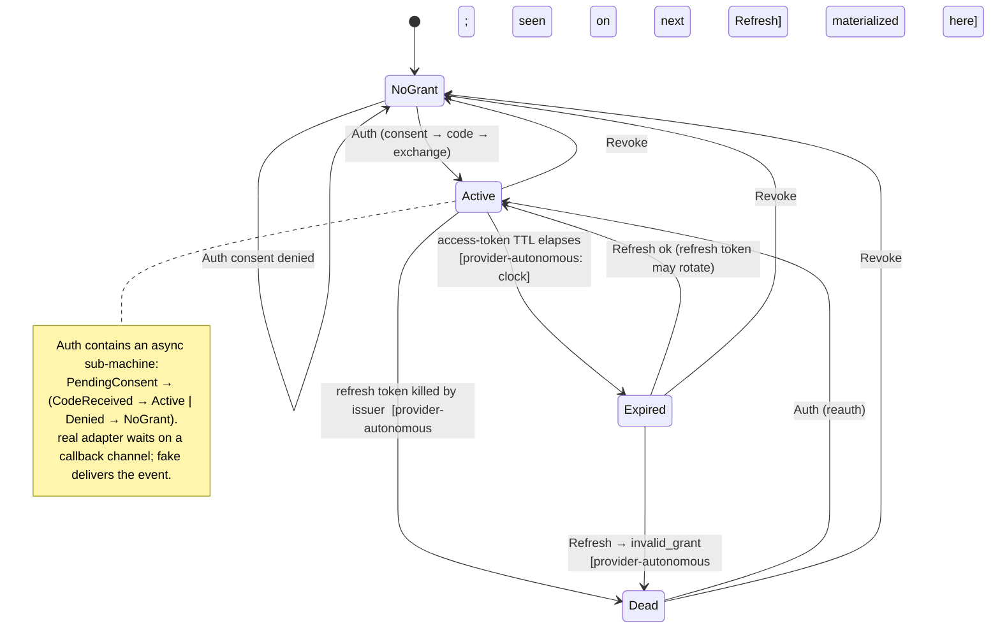

# Target: OAuth credential lifecycle state machine (consumer-POV)

A stored OAuth credential is **not one bit** ("valid / invalid"). It's a
lifecycle the consumer (charon's proxy, TUI, gcp setup) reasons about — and the
issuer (Google, and any future OIDC provider) runs a far larger *hidden* state
machine underneath it that we can only **infer** from how it answers our
operations. The commitment this target defends: **we model exactly one explicit
machine — the consumer-POV machine `S` below — and treat the `real` adapter and
the in-memory `fake` as two implementations of `S` that the dual-backend contract
test bisimulates. The provider's real machine is never modeled directly; it is
consulted only as an oracle through grounding.** (Full framing: the shim
state-machine pensive in ariadne — the `R` real / `M` fake-as-model / `S`
consumer-POV triad.)

The load-bearing consequence: **the issuer makes transitions we don't drive and
can't see** — it revokes our refresh token (password change, admin action,
refresh-token-reuse detection, policy TTL), or the access token simply ages out.
From our POV the credential moved underneath us with no operation from us; we
only *materialize* it on the next call, which now fails. **Those
provider-autonomous transitions are exactly what the fake's fault injection
models** — the fault knobs are not ad-hoc error cases, they are the named edges
of `S` that only the issuer (or the fake standing in for it) can fire. That is
what makes the `fake` a *model* of the provider, not a mock.

`S` is **provider-neutral**: the lifecycle is the invariant that lets the
`Provider` port generalize to a second provider (Microsoft / GitLab-OAuth /
Okta). Only the wire + payload differ per provider — endpoints, the
identity-claim extraction (`email`/`email_verified` for Google;
`preferred_username`/`upn` and *no* `email_verified` for Microsoft), the
error-code → edge mapping, and the revoke mechanism. The state machine doesn't
care which claim is the identity, only that it reached `Active`.

## State machine


```mermaid
stateDiagram-v2
    [*] --> NoGrant
    NoGrant  --> Active:   Auth (consent → code → exchange)
    NoGrant  --> NoGrant:  Auth consent denied
    Dead     --> Active:   Auth (reauth)
    Active   --> Expired:  access-token TTL elapses        [provider-autonomous: clock]
    Expired  --> Active:   Refresh ok (refresh token may rotate)
    Active   --> Dead:     refresh token killed by issuer  [provider-autonomous; seen on next Refresh]
    Expired  --> Dead:     Refresh → invalid_grant         [provider-autonomous; materialized here]
    Active   --> NoGrant:  Revoke
    Expired  --> NoGrant:  Revoke
    Dead     --> NoGrant:  Revoke

    note right of Active
      Auth contains an async sub-machine:
      PendingConsent → (CodeReceived → Active | Denied → NoGrant).
      real adapter waits on a callback channel; fake delivers the event.
    end note
```

ASCII (same thing, for terminal review):

```
 NoGrant
    │  Auth (consent → code → exchange)      [Denied ─▶ back to NoGrant]
    ▼
 Active ──(access TTL elapses)──▶ Expired ──Refresh ok──▶ Active   (refresh token may rotate)
    │                                │
    │  issuer kills refresh token    │  Refresh → invalid_grant
    └────────────┬───────────────────┘
                 ▼
               Dead ──Auth (reauth)──▶ Active

 any state ──Revoke──▶ NoGrant
```

`CheckHealth` is a **read**, not a transition: a non-persisting probe that
attempts `Expired → Active` and classifies the outcome (it does *not* write the
rotated credential back — see invariant 1).

### States × what holds (the belief surface)

| State     | access token live? | refresh token believed-valid? | consumer meaning |
|-----------|:---:|:---:|---|
| `NoGrant` | – | – | never authenticated, or revoked → must `Auth` |
| `Active`  | ✅ | ✅ | usable now (as of last observation) |
| `Expired` | – | ✅ | needs `Refresh`; recoverable without the user |
| `Dead`    | – | ❌ (rejected) | needs interactive reauth (`Auth`) |

"believed-valid" is the whole point: every non-`NoGrant` state is a **belief**,
not a guarantee — the issuer can move us to `Dead` between any two observations.

### Transitions × operation × code × grounding

| Transition | Kind | Operation | Where (real adapter) | Grounded vs real Google? |
|---|---|---|---|---|
| `NoGrant → Active` | consumer | `Auth` | `GoogleProvider.Auth` → browser + `waitForCallback` + `exchangeCode` → `credentialFromToken` | **No — manual** (consent leg non-headless) |
| `NoGrant → NoGrant` | consumer | `Auth` consent denied | `waitForCallback` returns `?error=` | **No — manual** |
| `Active → Expired` | **provider-autonomous (clock)** | — (time) | `cred.IsExpired()` honors `expires_in` | Equivalent by construction (deterministic clock; `expires_in` from Google) |
| `Expired → Active` | consumer | `Refresh` | `GoogleProvider.Refresh` → `applyRefresh` | **Yes — conformance** (Keychain refresh token) |
| `Active/Expired → Dead` | **provider-autonomous** | `Refresh` → `invalid_grant` | `applyRefresh` path; classified by `isReauthRequired` | **No — fake-only** (can't make Google kill a token on demand non-destructively) |
| `Dead → Active` | consumer | `Auth` (reauth) | same as `NoGrant → Active` | **No — manual** |
| `any → NoGrant` | consumer | `Revoke` | `GoogleProvider.Revoke` | **No — manual** (destructive: would invalidate the grounding token) |
| `CheckHealth` (read) | — | probe | `checkHealth(g.Refresh, cred)` | **Yes — conformance** (falls out of grounded `Refresh`) |

The fake fires the provider-autonomous edges via named knobs:
`RevokeGrant` / `Transient` / `DowngradeScope` (the `Active/Expired → Dead` and
scope-downgrade observations), `DenyConsent` / `WrongAccount` (the `Auth` leg).

## Invariants we defend

1. **State is a belief, lazily reconciled.** `Active` means "active as of last
   observation." The issuer can move us to `Dead` at any time, including between
   `CheckHealth` and the next call. `CheckHealth` is the explicit re-observe and
   deliberately does **not** persist a rotated token (a probe, not a write).
2. **Provider-autonomous transitions surface as faults.** A `Refresh` can fail at
   any time; the consumer must treat that as `→ Dead` (reauth) or `→ Unknown`
   (transient), never assume `Active` persists. The fake injects these as
   first-class edges so consumer code is tested against them.
3. **Refresh preserves identity + sidecars and rotates correctly.** `applyRefresh`
   is the single source of truth (both adapters): carry `Type`/`Provider`/
   `Account`, keep the old refresh token unless the response rotates it, default
   scopes to the old set, preserve `GCP`/`AIStudio`/`AdminKey`/`Catalog`.
4. **Reject unverified identity.** The Google identity extractor (`googleIdentity`)
   refuses `email_verified==false` (absent → false → rejected). This is a
   Google-layer payload guard, **inside** the per-provider seam — not an `S` edge.
   *(Realized at nous#48: the guard moved out of the shared `credentialFromToken`
   into `googleIdentity` when Microsoft — which has no `email_verified` claim —
   forced the identity extractor to become per-provider.)*
5. **The port is provider-neutral; the wire/payload is the variant.** `S` is the
   same for every OIDC provider. A new provider supplies a `dialect` (provider id,
   required scopes, auth-URL params, identity-claim extractor, PKCE flag, revoke
   mechanism) injected into the **one** generic `OIDCProvider` — not a new machine
   and not a second adapter — and **no shared cross-service framework**
   (ariadne#71 rule; the `dialect` lives inside package `oauth`, varies only OIDC
   providers, each still its own `Conf`). *(Realized seam list confirmed at
   nous#48 — see Revisions.)*
6. **Grounding is honest.** `Refresh` + `CheckHealth` are grounded against real
   Google; the consent leg, `Revoke`, and provider-autonomous revocation are
   fake-only/manual. Don't claim coverage the mechanism can't deliver (the nous#42
   discipline). The transition table's grounding column *is* the boundary doc.

## Why now

Building `shim(google-oauth)` (nous#44, instance #2 of the ariadne#71 pattern)
surfaced that the fake is not stubbed responses — it's an executable model of the
issuer's hidden machine, and the consumer-POV machine deserves to be explicit so
(a) the fake's fidelity is legible, (b) the fault set is principled rather than
ad-hoc, and (c) the second provider (Microsoft) has a neutral spec to satisfy.
Writing `S` down is what lets the next consumer (and the next provider) honor the
whole machine — including the provider-autonomous edges — by default. This target
also feeds ariadne#71's promotion gate and nous#46's gh-shim retrofit (the
cross-domain check: does one `S`-formalism fit both credential-lifecycle and
control-plane-CRUD shapes? the existing `collaborator-state-machine` target is the
control-plane sibling).

## What this is NOT

- **Not the issuer's real internal machine.** Token families, refresh-token-reuse
  detection, consent records, tenant policy — we model only the observable
  quotient under our operations, never `R` itself.
- **Not a multi-provider framework.** `S` is shared narrative; each provider is
  its own `Conf` + adapter. No shared transport/abstraction layer.
- **Not the scope-catalog or health-badge UI.** Those *consume* the machine; this
  target is the lifecycle they branch on.
- **Not OAuth-the-spec.** Surface = exactly what charon's consumers use (Auth /
  Refresh / Revoke / CheckHealth), not a faithful reimplementation of OAuth2.

## Open questions

- **Async-callback sub-machine — recurring shape?** `Auth` contains a nested
  `PendingConsent → CodeReceived | Denied` machine with an async event (the
  redirect). Is "a transition containing a sub-machine the fake drives by
  delivering events" a pattern worth naming across shims, or an OAuth one-off?
  Watch the next few instances (nous#45).
- **Is scope-downgrade a state or an observation?** `DowngradeScope` is currently
  an `Active → Active` self-loop modeled as a fault knob, not a distinct state. If
  a consumer ever branches on "scopes shrank under me," it may deserve its own
  state.
- **Does any consumer need `Active` vs `Expired` beyond `IsExpired()`?** Today
  only the proxy/token-supplier distinguishes them (refresh-on-expiry). If nothing
  else does, the distinction stays an implementation detail of the read path.

## Revisions

### 2026-06-08 — n=2-real: Microsoft/Entra as the 2nd provider (nous#48)

Microsoft (Entra ID) landed as the second real backend behind the **same**
`Provider` port and the **same** `S`, validating that the abstraction is real and
not a Google-shaped quotient. The architecture held: **one** generic
`OIDCProvider` (renamed from `GoogleProvider`) drives Auth/Refresh/Revoke/exchange
for every provider; the per-provider variation is an injected `dialect` value, and
Google + Microsoft are sibling provider files over a shared core. No shared
cross-service framework (ariadne#71 honored — the `dialect` is in-package).

**The seam Microsoft forced into existence** (= what was "by inspection" in nous#44,
now grounded):

- **Identity extractor** is now per-provider (`dialect.extractID`). The hardcoded
  `Provider:"google"` + email-verified logic left `credentialFromToken`; it now
  takes `(providerID, extractID)`. `googleIdentity` reads `email` + rejects
  unverified; `microsoftIdentity` reads `preferred_username` (→ `upn` fallback)
  with **no verified claim** (MS has neither a reliable top-level `email` nor
  `email_verified`). This proved invariant 4's guard was always Google-specific —
  it moved *into* `googleIdentity`, not into the shared core.
- **PKCE** is a new dialect dimension (`dialect.usePKCE`). MS is a **public client**
  (no secret); the real `Auth` mints a per-call `code_verifier`, layers the S256
  challenge on the auth URL, and sends the verifier on exchange. The shared token
  POSTs omit `client_secret` when empty — so public (MS/PKCE) and confidential
  (Google/secret) clients use one code path.
- **`offline_access` scope** (vs Google's `access_type=offline` auth-URL param) is
  how MS issues a refresh token — captured in `requiredMicrosoftScopes` +
  `microsoftAuthParams`.
- **No token-revoke endpoint.** MS has no RFC-7009 per-token revoke; the only
  mechanism (Graph `revokeSignInSessions`) is global across every app and needs an
  elevated token. So `Provider.Revoke` is honestly `ErrRevokeUnsupported` for MS —
  the port method exists for uniformity, but the grounding boundary differs by
  *mechanism*, not just (as for Google) by destructiveness.
- **Always-rotate ⇒ opposite grounding-persistence discipline.** MS refresh tokens
  are single-use (every Refresh rotates). The shared contract body (Refresh, then
  CheckHealth-which-Refreshes) consumes the seed and the only live token ends up in
  CheckHealth's discarded rotation — so `Contract_RealMicrosoft` wraps the provider
  in an `rtCapture` decorator and **persists the final rotated token back to
  Keychain**, making grounding repeatable. Google's token is reusable and its test
  deliberately does **not** persist (probe semantics, invariant 1). *Same `S`
  contract body (`runOAuthContract`), opposite persistence discipline — that
  asymmetry is itself cross-provider evidence the lifecycle, not the wire, is the
  invariant.*

**Hermetic certification:** the dialect-aware `Fake` certifies `runOAuthContract`
under **both** Google and Microsoft dialects (`TestContract_Fake` +
`TestContract_FakeMicrosoft`), always-on in CI. The MS wire (PKCE verifier, no
`client_secret`, rotation, `preferred_username`/`upn`) is grounded against an
`httptest` server in `microsoft_test.go`. Real-MS grounding
(`Contract_RealMicrosoft`, `conformance`-tagged) skips without an Entra app +
Keychain token, exactly as Google's does.

**Real-Microsoft grounding certified (2026-06-11).** A single-tenant public-client
Entra app (`xian@xldigit.com`, tenant `6daae80a…`, PKCE, no secret) issued a real
refresh token (stored in Keychain `nous-oauth-conformance-microsoft` via
`cmd/oauth-conformance-provision -provider microsoft`). `go test -tags conformance
./lib/provider/oauth/ -run Contract_RealMicrosoft` **PASSED**, and **passed again
on an immediate re-run** — proving the `rtCapture` rotated-token write-back makes
grounding repeatable despite Microsoft's single-use rotation (the seed token from
run 1 is dead by run 2; only the persisted rotation survives). The fake matches
real Microsoft on the grounded edges (`Expired→Active` Refresh + the `CheckHealth`
read). The consent leg, `Revoke` (`ErrRevokeUnsupported` — no MS mechanism), and
`→Dead` remain fake-only/manual. n=2-real is now grounded, not just designed.

### 2026-06-08 — first real-Google grounding certification (nous#49)

The Google `real` backend is now **certified**, not just wired. With a
throwaway-account refresh token (`xiantester2003@gmail.com`, issued by charon's
client, stored in Keychain `nous-oauth-conformance-google` via
`cmd/oauth-conformance-provision`), `go test -tags conformance
./lib/provider/oauth/ -run Contract_Real` **PASSED** — the fake matches real
Google on the grounded edges (`Expired→Active` Refresh + the `CheckHealth` read).
The grounding column of the transition table above is now backed by a passing run,
not just an intended one. Re-cert ~monthly or on suspected drift (re-run the
provisioner + the conformance test; see `cmd/oauth-conformance-provision/SKILL.md`).
The consent leg, `Revoke`, and `→Dead` remain fake-only/manual as documented.

---

*Agent-drafted 2026-06-08 during nous#44 M2. The commitment layer — slim;
the executable detail lives in `lib/provider/oauth/{fake,token}.go` and the
contract test.*
